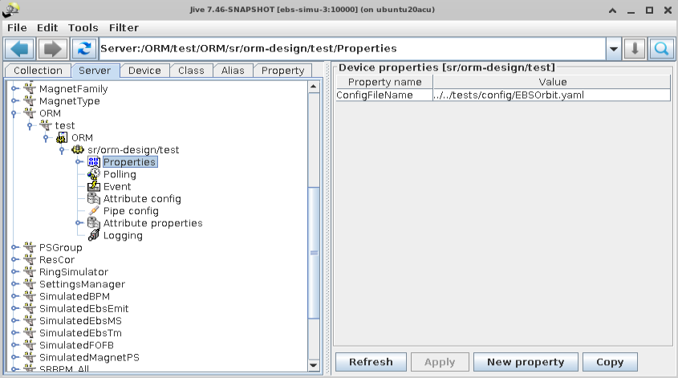
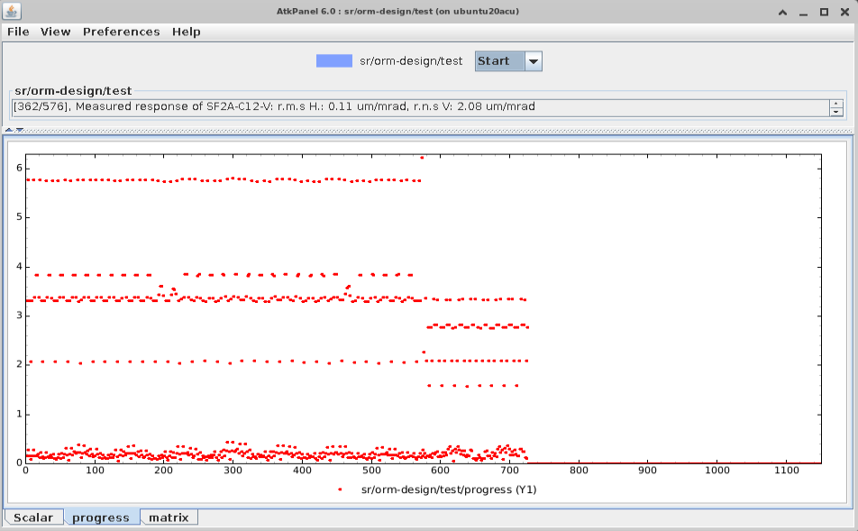
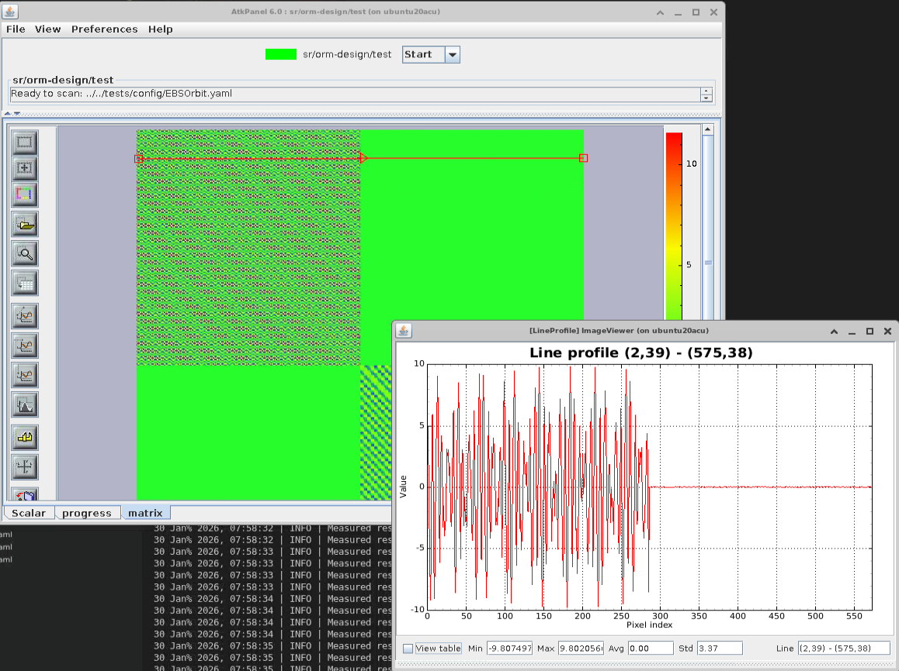

# ORM Tango server

A minimalist Tango server that show how to run a PyAML measurement tool,

Configuration of the tango server.

Plot displaying the scan progress, orbit rms h and v are plotted for each 576 sterrer.
You can guess the effect of the beta function on the top and the coupling on the bottom.

The ORM
